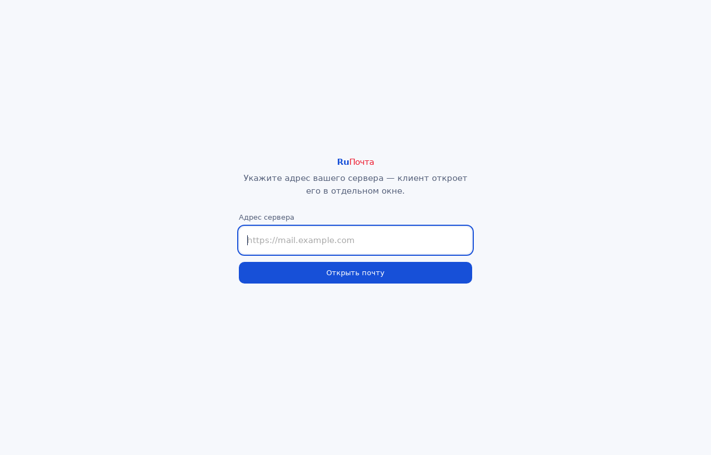

# Десктопный и мобильный клиент



Клиент — нативное окно над вашим собственным сервером RuПочта, а не вторая
реализация почтового интерфейса. При первом запуске он спрашивает адрес сервера,
запоминает его и дальше открывается сразу на почте.

## Почему так

Веб-интерфейс отдаёт сервер, и у каждой инсталляции он свой. Копировать
интерфейс внутрь приложения значило бы поддерживать две версии одного экрана и
расходиться с сервером при каждом обновлении. Поэтому клиент даёт то, чего
браузер не даёт: отдельное окно, ярлык, системные уведомления, обработчик
`mailto:` и автозапуск.

Адрес принимается только по `https` — исключение сделано для `localhost` и
`127.0.0.1`, потому что следом экран просит пароль от почтового ящика.

## Стек

[Tauri 2](https://v2.tauri.app/): системный webview вместо своего Chromium, за
счёт чего сборка весит единицы мегабайт, одна кодовая база на десктоп и
мобильные, установщики всех форматов из коробки.

Решение принято как рабочее, а не окончательное — если у вас есть аргументы за
другой стек, они принимаются в [обсуждениях](https://github.com/lmcorp-it/RuPochta/discussions).

## Сборка

Нужен [Rust](https://rustup.rs/) и системные библиотеки webview. На Debian и
Ubuntu:

```bash
sudo apt-get install -y libwebkit2gtk-4.1-dev librsvg2-dev patchelf \
  build-essential libssl-dev libgtk-3-dev libayatana-appindicator3-dev pkg-config
cargo install tauri-cli --version "^2" --locked
```

Дальше из `desktop/src-tauri`:

```bash
cargo tauri dev                      # запуск с горячей перезагрузкой
cargo tauri build --bundles deb      # пакет для текущей системы
```

На Windows и macOS системные библиотеки уже есть; ставится только Rust и
`tauri-cli`.

| Система | Что собирается | Чем собирается |
|---|---|---|
| Linux | `.deb`, `.rpm`, AppImage | `--bundles deb,rpm,appimage` |
| Windows | `.msi`, `.exe` | `--bundles msi,nsis` |
| macOS | `.dmg` | `--bundles dmg` |

Установщики собираются только на своей системе: подпись и упаковка для Windows
и macOS кросс-компиляцией не делаются. Workflow
[`desktop.yml`](../.github/workflows/desktop.yml) собирает все три на своих
раннерах и выкладывает артефакты.

## Что дальше

Каркас запускается и упаковывается, но это ещё не готовый продукт. Открытые
задачи по платформам: [#9 Windows](https://github.com/lmcorp-it/RuPochta/issues/9),
[#10 macOS](https://github.com/lmcorp-it/RuPochta/issues/10),
[#11 Linux](https://github.com/lmcorp-it/RuPochta/issues/11),
[#12 Android](https://github.com/lmcorp-it/RuPochta/issues/12),
[#13 iOS](https://github.com/lmcorp-it/RuPochta/issues/13).

Ближайшее, чего не хватает: подпись установщиков, автообновление, системные
уведомления, обработчик `mailto:` и мобильные сборки (`cargo tauri android init`,
`cargo tauri ios init`).
